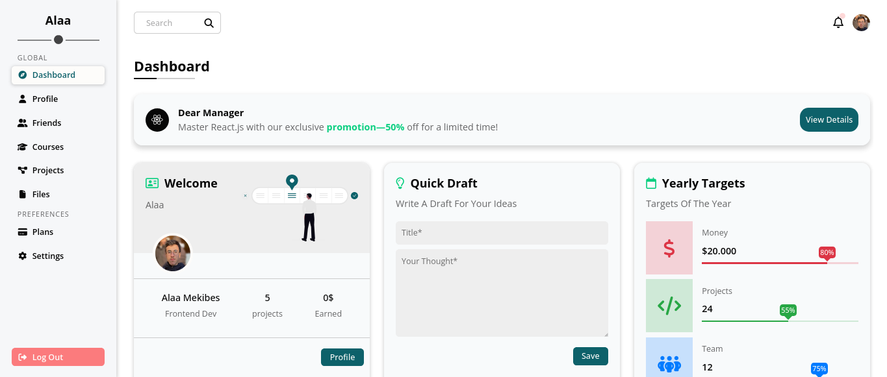

# Website Dashboard README 🚀

Welcome to the repository for my **Website Dashboard** project! This project is a fully responsive dashboard design created using **HTML** and **CSS**. I completed this project as part of the **Elzero Web School** tutorial series, specifically [Design 4](https://youtu.be/DflEcuzjsyA?si=OnxoNsgXSwYUsxR3). I'm proud to say that I built this entire project **from scratch** and **on my own**! 🎉



---

## 📌 Project Overview

This dashboard is a sleek and modern web interface designed to manage various tasks, projects, and data. It includes multiple sections like **Profile**, **Viewer**, **Website**, **Trucker**, **Testing Targets**, **Tickets Statistics**, **Latest News**, **Latest Tasks**, **Search Items**, **Latest Uploads**, **Last Project Progress**, **Semiuders**, **Latest Post**, **Social Media Stats**, and **Projects**.

---

## 🛠️ Tools & Technologies Used

- **HTML5** & **CSS3**: The core technologies used to build the structure and style of the dashboard.
- **FontAwesome**: For adding beautiful icons to the interface.
- **Undraw**: For illustrations that enhance the visual appeal of the dashboard.
- **Custom CSS Framework**: I wrote my own lightweight CSS framework to style the dashboard efficiently.
- **Responsive Design**: The dashboard is fully responsive and works seamlessly on different screen sizes.

---

## 🌟 Features

- **Custom Checkbox Styling**: Learned how to style checkboxes using CSS.
- **Tooltips**: Added tooltips to provide additional information on hover.
- **Advanced CSS Selectors**: Utilized `:where` and `:is` selectors for efficient styling.
- **Multiple HTML Pages**: Created multiple HTML pages to simulate a real-world dashboard.
- **Responsive Design**: Ensured the dashboard looks great on all devices, from desktops to mobile phones.

---

## 🎨 Design Highlights

- **Clean & Modern UI**: The design is minimalistic yet functional, with a focus on user experience.
- **Custom Illustrations**: Used **Undraw** for illustrations to make the dashboard visually appealing.
- **FontAwesome Icons**: Integrated icons for better visual communication.
- **Responsive Layout**: The layout adapts to different screen sizes, ensuring a consistent experience across devices.

---

## 📂 Project Structure

Here’s a quick overview of the project structure:

```
Dashboard/
│
├── assets/
│   ├── files/
│   └── images/
│
├── css/
│   ├── font-awesome.css
│   ├── framework.css
│   └── style.css
│
├── pages/
│   ├── courses.html
│   ├── files.html
│   ├── friends.html
│   ├── logIn.html
│   ├── notification.html
│   ├── plans.html
│   ├── profile.html
│   ├── projects.html
│   ├── settings.html
│   └── signUp.html
│
├── webfonts/
├── index.html
├── readme.md
└── screenshot.png
```

---

## 🚀 How to Use

1. **Clone the Repository**:
   ```bash
   git clone https://github.com/alaa-mekibes/fourth-project-html-css.git
   ```
2. **Open the Project**:
   - Navigate to the project folder and open `index.html` in your browser to view the dashboard.

3. **Explore the Code**:
   - Check out the `framework.css` file to see the custom CSS framework I created.
   - Explore the `pages/` folder to see additional HTML pages.

---

## 📚 What I Learned

- **Advanced CSS Techniques**: Learned how to use `:where` and `:is` selectors, custom checkboxes, and tooltips.
- **Responsive Design**: Gained a deeper understanding of making layouts responsive.
- **Custom Framework**: Created my own CSS framework, which was a great learning experience.
- **Project Management**: Managed the entire project independently, from design to implementation.

---

## 🙌 Credits

- **Elzero Web School**: For the amazing tutorial series that inspired this project.
- **FontAwesome**: For the beautiful icons.
- **Undraw**: For the awesome illustrations.

---

## 📝 Future Improvements

- **Add JavaScript**: To make the dashboard more interactive.
- **Integrate Backend**: To handle dynamic data and user interactions.
- **Enhance Accessibility**: Improve accessibility features for better user experience.

---

## 📧 Contact

If you have any questions or feedback, feel free to reach out to me! 😊

- **Email**: mekibes.al@gmail.com
- **GitHub**: [your-username](https://github.com/alaa-mekibes)

---

Thank you for checking out my project! I hope you find it useful and inspiring. If you like it, don’t forget to give it a ⭐️ on GitHub!

Happy Coding! 🚀
